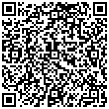
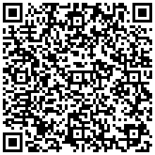
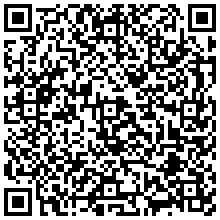
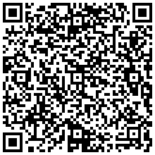
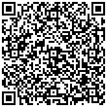

# 2018-04-04最新**免费Shadowsocks账号**

2018-04-04最新发布的**免费Shadowsocks账号**。

如果您需要自己的专属账号，请到[https://pro.biulink.xyz](https://pro.biulink.xyz)注册，将直接获取一周的**免费Shadowsocks账号**。

## [公告：搬瓦工年付29.9美元的CN2主机补货了！](https://bwh1.net/aff.php?aff=23103)
  前两周搬瓦工29.9美元的CN2主机一直缺货，最便宜的需要49.9美元，今天看到29.9美元的又补货了，需要的赶紧下手。直达链接：[https://bwh1.net](https://bwh1.net/aff.php?aff=23103)
## [教程：自己动手搭建超实惠的Shadowsocks服务器 - 搬瓦工篇](https://github.com/Biulink/ShadowsocksTutorials/blob/master/%E6%95%99%E6%82%A8%E8%87%AA%E5%B7%B1%E5%8A%A8%E6%89%8B%E6%90%AD%E5%BB%BA%E8%B6%85%E5%AE%9E%E6%83%A0%E7%9A%84Shadowsocks%E6%9C%8D%E5%8A%A1%E5%99%A8%20-%20%E6%90%AC%E7%93%A6%E5%B7%A5%E7%AF%87.md)
  
  本图文教程详细介绍了如何搭建Shadowsocks服务器。自己搭建Shadowsocks服务器有如下优势：

  优势1: 独享一台Shadowsocks服务器，不与其他用户共享资源。

  优势2: 配备CN2专线，Youtube 1080p无压力。

  优势3: 支持一键换IP地址，不用担心被封。

  优势4: 比直接买SS账号B格略高 🙂

  费用: 最低每月16元，本站还提供9.4折优惠码:BWH1ZBPVK  
## 免费Shadowsocks账号1

地址：us2bylee.biulink.xyz

端口：20746

密码：https_biulink_xyz_199373

加密方式：aes-256-cfb

流量：50GB

过期时间：2018-04-05 00:00:16

## 免费Shadowsocks账号2

地址：sg1.biulink.xyz

端口：20746

密码：https_biulink_xyz_199373

加密方式：aes-256-cfb

流量：50GB

过期时间：2018-04-05 00:00:16

## 免费Shadowsocks账号3

地址：hk1.biulink.xyz

端口：20746

密码：https_biulink_xyz_199373

加密方式：aes-256-cfb

流量：50GB

过期时间：2018-04-05 00:00:16

## 免费Shadowsocks账号4

地址：jp1.biulink.xyz

端口：20746

密码：https_biulink_xyz_199373

加密方式：aes-256-cfb

流量：50GB

过期时间：2018-04-05 00:00:16

## 免费Shadowsocks账号5

地址：us1.biulink.xyz

端口：20746

密码：https_biulink_xyz_199373

加密方式：aes-256-cfb

流量：50GB

过期时间：2018-04-05 00:00:16

